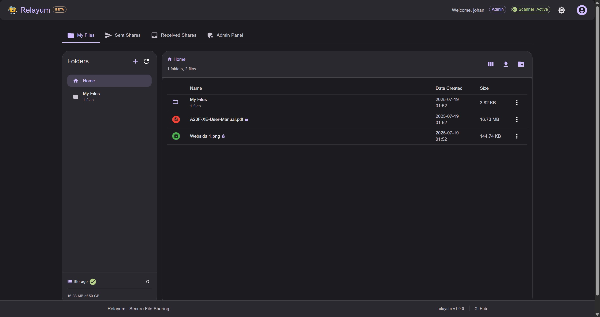

# Relayum - Secure File Sharing Platform



[](https://github.com/jisevind/relayum)
[](LICENSE)
[](https://github.com/jisevind/relayum/releases)
[](https://nodejs.org/)
[](https://reactjs.org/)
[](https://www.postgresql.org/)

A modern, production-ready file sharing application built with React, Node.js, Express, and PostgreSQL. Relayum provides secure file and folder management with comprehensive sharing capabilities, user authentication, and optional virus scanning integration.

## 📸 Screenshots

[View all screenshots →](screenshots/)

## Overview

Relayum is a file sharing application designed for individuals and teams who need secure file management and sharing. Built with React and Node.js, it provides a clean web interface for file operations with enterprise-grade security features.

**Key Features:**
- 🔒 **Secure Storage**: AES-256 encryption for file metadata and content
- 🔗 **Flexible Sharing**: Public and private file sharing with expiration dates
- 📁 **Folder Management**: Hierarchical organization with drag-and-drop interface
- 🛡️ **Virus Scanning**: Integrated ClamAV for malware detection
- 👥 **User Management**: Role-based authentication and admin controls
- 💾 **Storage Quotas**: Per-user disk quotas and usage tracking
- 🌓 **Modern UI**: Dark/light theme support with Material-UI
- 📊 **Admin Dashboard**: Comprehensive management tools and analytics
- 🔐 **Security Features**: Rate limiting, CORS, security headers, and more
- 🚀 **Docker Ready**: Production-ready containerized deployment

## Quick Start

1. **Download configuration:**
   ```bash
   wget https://raw.githubusercontent.com/relayum/relayum/main/.env.example
   wget https://raw.githubusercontent.com/relayum/relayum/main/docker-compose.yml
   ```

2. **Configure environment:**
   ```bash
   cp .env.example .env
   # Edit .env with your settings (see Security section below)
   ```

3. **Deploy:**
   
   **With virus scanning (recommended):**
   ```bash
   docker-compose --profile clamav up -d
   ```
   
   **Without virus scanning:**
   ```bash
   docker-compose up -d
   ```
   
   > **Note:** ClamAV initialization can take 5-10 minutes for virus definition downloads. The app will start before ClamAV is ready.

4. **Access:** Open `http://localhost:3020`

## Security Configuration

**IMPORTANT:** Change these required settings in your `.env` file:

```env
# Database password
DB_PASSWORD=your_secure_password

# JWT secrets (generate with: openssl rand -hex 32)
JWT_SECRET=your_32_character_jwt_secret_here
JWT_REFRESH_SECRET=your_32_character_refresh_secret_here

# Metadata encryption key (generate with: openssl rand -hex 32)
METADATA_ENCRYPTION_KEY=your_32_character_metadata_key_here

# Admin account
ADMIN_USERNAME=your_admin_username
ADMIN_EMAIL=admin@yourdomain.com
ADMIN_PASSWORD=your_admin_password

# Domain (for production)
CORS_ALLOWED_ORIGINS=https://yourdomain.com
```

## Requirements

- **Docker**: 20.10+ with Docker Compose 2.0+
- **Memory**: 2GB RAM (4GB recommended with virus scanning)
- **Storage**: 10GB+ disk space
- **Network**: Internet access for initial setup and virus definition updates

## Architecture

### Technology Stack
- **Frontend:** React 18 with Material-UI v6, React Router v6, TanStack Query
- **Backend:** Node.js with Express, JWT authentication, Helmet security
- **Database:** PostgreSQL 15 with connection pooling
- **Security:** AES-256 encryption, bcrypt hashing, rate limiting, CORS
- **Virus Scanner:** ClamAV with configurable scanning modes
- **Containerization:** Multi-stage Docker builds with security hardening

### Key Components
- **File Management**: Secure upload, encryption, and storage
- **Sharing System**: Public/private links with expiration and access controls
- **Admin Panel**: User management, system monitoring, and configuration
- **Virus Scanning**: Real-time malware detection with quarantine
- **Anonymous Sharing**: Optional anonymous file upload functionality

## Production Readiness

**This software is actively developed and includes production-ready features:**

✅ **Security Hardened**: Multiple layers of security controls
✅ **Docker Optimized**: Multi-stage builds with security best practices
✅ **Health Checks**: Built-in monitoring and health endpoints
✅ **Logging**: Structured logging with rotation
✅ **Performance**: Optimized database queries and caching

**Production Checklist:**
- [ ] Test thoroughly in staging environment
- [ ] Configure proper backup strategies
- [ ] Set up monitoring and alerting
- [ ] Review and update security configurations
- [ ] Consider professional security audit for sensitive deployments

## Documentation

- **Environment Variables:** [docs/ENVIRONMENT_VARIABLES.md](docs/ENVIRONMENT_VARIABLES.md)

## Contributing

This project is in early development. Contributions, bug reports, and feature requests are welcome through GitHub Issues.

## ☕ Support the Project

If you find Relayum useful, consider supporting its development:

[](https://www.paypal.com/paypalme/johanisevind/5)
[](https://www.paypal.com/paypalme/johanisevind/10)
[](https://www.paypal.com/paypalme/johanisevind/25)
[](https://www.paypal.com/paypalme/johanisevind)

Your support helps maintain and improve this open-source project. Thank you! 🙏

## License

MIT License - see LICENSE file for details.

## Support

For issues and questions:
- GitHub Issues: Report bugs and request features
- Security Issues: Report privately to maintain responsible disclosure

---

**Use at your own risk. Always maintain proper backups and test in non-production environments first.**